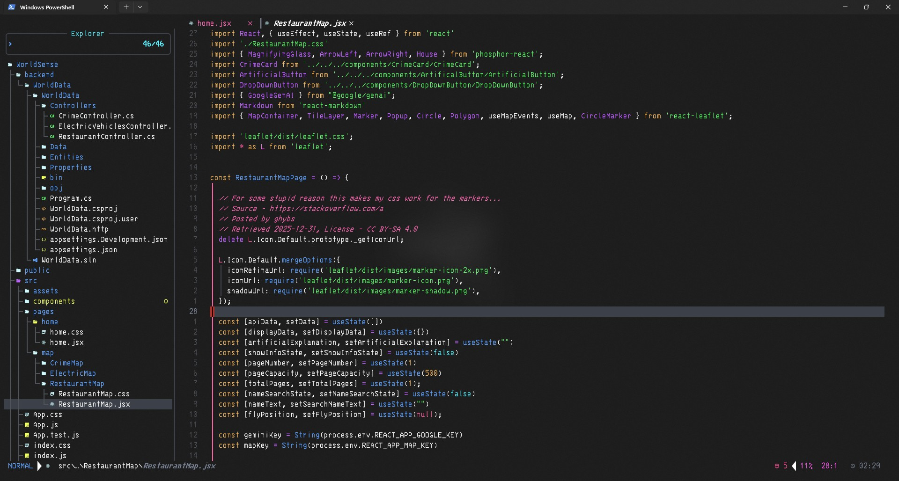
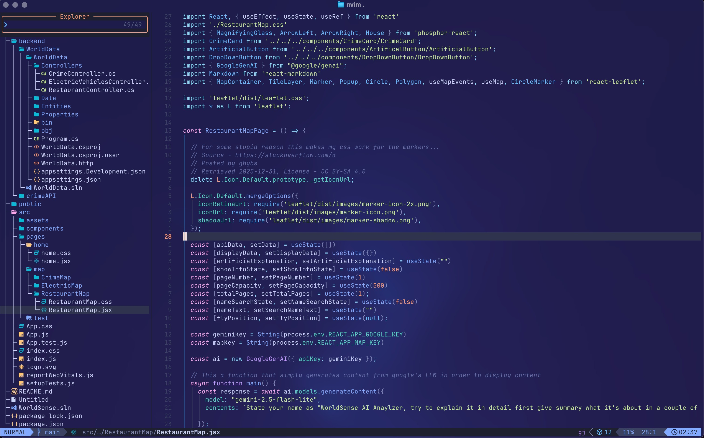

My LazyVim's Themes

## Theme One
- This depends on whether your terminal looks blurry. I made this for my window os

  


## Theme Two
- This depends on whether your terminal looks blurry. I made this for my mac os, with ghostty terminal, I have the config for that too.

  



### How To Use
- Make sure lazyvim is installed, obviously
- Get Ghostty for Mac, or get the Windows Terminal app from the Microsoft Store for Windows
- Just replace the nvim folder with your current nvim folder. You can find them inside the theme folders

**Example**


How to find your Neovim configs on Windows
```
cd C:\Users\{your username}\AppData\Local\nvim
```
How to find your Neovim configs on Mac

```
cd ~/.config/nvim
```

